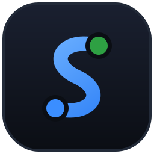
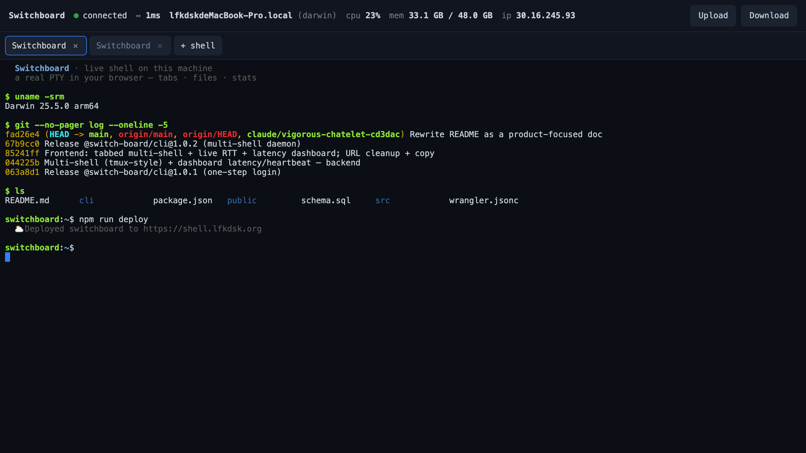
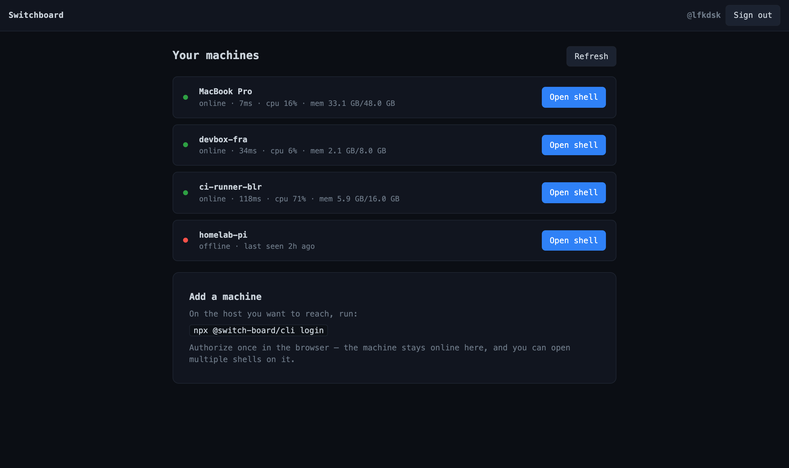
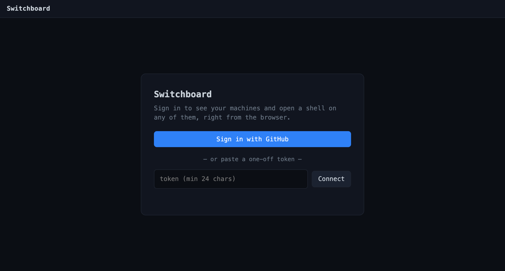

<p align="center">
  
</p>

<h1 align="center">Switchboard</h1>

<p align="center">
  <strong>A shell on any of your machines — right in your browser. No SSH config, no inbound ports, no VPN.</strong>
</p>

<p align="center">
  <a href="https://www.npmjs.com/package/@switch-board/cli"></a>
  &nbsp;<a href="https://www.npmjs.com/package/@switch-board/cli"></a>
  &nbsp;
</p>

<p align="center">
  
  <br><sub><em>A real shell in the browser — tabbed multi-shell, live RTT / CPU / memory, drag-and-drop file transfer.</em></sub>
</p>

Run one command on a machine and it shows up in your browser dashboard. Click it
and you get a real interactive terminal — tabs, file transfer, live host
stats — even when that machine sits behind NAT or a corporate firewall. Both the
machine **and** the browser dial *out* to a Cloudflare relay, so there's nothing
to port-forward and nothing to expose.

> Think of an old telephone switchboard: every connection is a **circuit**, and
> the operator — a Cloudflare Worker plus a Durable Object — patches your
> machine's line straight through to your browser's.

---

## Try it in 30 seconds

No install, no deploy — this uses the hosted relay at **`shell.lfkdsk.org`**:

```bash
npx @switch-board/cli login
```

It opens your browser, signs you in with GitHub, and exposes this machine's shell
under your account in one step. The dashboard URL it prints lists your machine —
click **Open shell** and you're in.

Just want to hand someone temporary access instead?

```bash
npx @switch-board/cli           # prints a one-off token + URL
```

Anyone you give that URL to gets a shell on the machine — handy for pairing or
quick remote help. No sign-in required; the token *is* the key (see
[Security](#security)).

<p align="center">
  
  <br><sub><em>Every machine you've signed in shows up here with live status — online, latency, CPU, memory.</em></sub>
</p>

---

## What you get

- **🖥️ A real terminal in the browser** — full xterm.js: 256-color, resize,
  scrollback, copy/paste. Not a log viewer — your actual shell.
- **📊 All your machines, one dashboard** — sign in with GitHub and every machine
  you've bound is listed with live status: online/offline, round-trip latency,
  CPU, memory, and last-seen.
- **🗂️ Multiple shells, tmux-style** — open as many tabs as you want on a single
  machine. Shells survive tab reloads and flaky links; in account mode they keep
  running even after you close the browser, so you can reattach right where you
  left off.
- **📁 Drag-and-drop file transfer** — drop a file onto the page to upload it
  into the active shell's working directory, or pull any file off the host with a
  click.
- **🔌 Works behind NAT** — the daemon dials out over WebSocket. No inbound
  ports, no firewall rules, no VPN, no tunnel to babysit.
- **💤 Free at idle** — built on Cloudflare's hibernatable WebSockets, so idle
  terminals cost nothing and the whole thing runs on the free Workers plan.
- **🛠️ Self-hostable** — the relay is a few hundred lines of Worker code. Deploy
  your own and own the entire stack end to end.

---

## Two ways to connect

|                          | **Account** — `switchboard login`     | **Token** — `switchboard`              |
| ------------------------ | ------------------------------------- | -------------------------------------- |
| Sign-in                  | GitHub, once per machine              | none                                   |
| Who can open the shell   | only you                              | anyone holding the token               |
| Appears in the dashboard | ✅ with live stats                     | —                                      |
| Shell lifetime           | persists — reattach anytime           | persists across reloads (60s grace)    |
| Best for                 | your own machines                     | sharing · pairing · one-offs           |

Both modes give you the multi-tab terminal and file transfer; they differ only in
*who* can connect and how long shells stick around.

<p align="center">
  
</p>

---

## How it works

```
       your machine(s)                  Cloudflare  (the operator)             your browser
  ┌────────────────────────┐            ┌──────────────────────────┐
  │  @switch-board/cli      │   wss      │  Worker + Durable Object │   wss    ┌────────────────┐
  │  daemon  =  your shell  │ ─────────▶ │  "Circuit"  (one/token   │ ◀─────── │  xterm.js UI   │
  │                         │  dials out │   or one/machine)        │ dials in │  + dashboard   │
  └────────────────────────┘            │  + D1 account registry   │          └────────────────┘
        no inbound ports                └──────────────────────────┘       tabs · files · stats
```

- Both ends **dial out** over WebSocket — keystrokes flow one way, terminal
  output the other.
- `idFromName(token-or-machine)` funnels every daemon and browser on the same
  circuit into a single Durable Object — the operator that patches them together
  and broadcasts host output to every open tab.
- The relay is a **transparent forwarder**: it pairs the two ends and shovels
  frames between them. It never parses your terminal payload.
- A small **D1** database holds the account bookkeeping — which machines belong to
  whom, hashed agent tokens, and the heartbeat that powers the live dashboard.
  Terminal traffic never touches it.

The repo ships **both ends** — relay and daemon — so protocol-level features
(end-to-end encryption, port forwarding, …) can be built across the wire at once.
The daemon is wire-compatible with [`@elsetech/webterm`](https://www.npmjs.com/package/@elsetech/webterm),
which it's a clean reimplementation of.

---

## Self-host your own relay

Want to own the stack? Deploy the relay to your own Cloudflare account:

```bash
git clone https://github.com/lfkdsk/Switchboard.git && cd Switchboard
npm install
npx wrangler login                                   # one-time, opens a browser

# create the D1 registry and load the schema
npx wrangler d1 create switchboard_db                # paste the printed id into wrangler.jsonc
npx wrangler d1 execute switchboard_db --remote --file schema.sql

npx wrangler secret put SESSION_SECRET               # any long random string
npm run deploy
```

Wrangler prints your URL (e.g. `https://switchboard.<subdomain>.workers.dev`).
Point the daemon at it:

```bash
npx @switch-board/cli --server https://switchboard.<subdomain>.workers.dev
```

To serve it on your own domain, add a route in `wrangler.jsonc`:

```jsonc
"routes": [{ "pattern": "switchboard.example.com", "custom_domain": true }]
```

> **Heads up on GitHub login:** the dashboard's GitHub sign-in is wired to the
> author's shared auth broker (`auth.lfkdsk.org`) and OAuth app. A fresh deploy
> works great in **token mode** out of the box; to get the account dashboard on
> your own domain, point `src/auth.js` at your own GitHub OAuth app and callback.

### Local development

```bash
npm run dev                 # wrangler dev → http://localhost:8787
npx @switch-board/cli --server http://localhost:8787
```

The daemon rewrites `http→ws` automatically. Durable Objects, hibernatable
WebSockets, and a local D1 all run under `wrangler dev` (apply the schema once
with `--local` instead of `--remote`).

---

## CLI reference

```
switchboard login            Sign in via the browser, then expose this machine's
                             shell under your account — one step.
switchboard                  Expose this shell using saved credentials, or an
                             anonymous one-off token if you're not signed in.
switchboard logout           Remove the stored account credential.
```

| Option | Description |
| --- | --- |
| `-t, --token <token>` | Force anonymous mode with this token (min 24 chars). |
| `-s, --server <url>`  | Relay origin. Default: `https://shell.lfkdsk.org`. |
| `--shell <path>`      | Shell to spawn. Default: `$SHELL`, else `bash`/`powershell`. |
| `-v, --version`       | Print version and exit. |
| `-h, --help`          | Show help and exit. |

Environment variables (overridden by the flags above): `SWITCHBOARD_TOKEN`,
`SWITCHBOARD_SERVER`, `SWITCHBOARD_SHELL`. The `WEBTERM_*` equivalents are also
accepted for drop-in compatibility. Account credentials live in
`~/.switchboard/config.json` (mode `0600`).

---

## Security

- **The token is the only credential in token mode.** Anyone with it gets a shell
  on the host — treat it like a password. It's a fresh 256-bit random value per
  run, so guessing is infeasible.
- **Account mode is gated by GitHub identity.** A machine bound with
  `switchboard login` can only be opened by the signed-in owner; sessions are
  HMAC-signed cookies, and agent tokens are stored **hashed** (SHA-256) in D1.
- **The relay sees plaintext.** TLS terminates at the Worker, so the operator
  (you, when self-hosting) can see the stream. Switchboard is **not** end-to-end
  encrypted — self-hosting removes the third party, not the relay's visibility.
  Because the relay forwards opaque bytes, you can layer E2E (e.g. X25519 + an
  AEAD between daemon and browser) without changing it.
- **Gate the relay itself** with Cloudflare Access if you want auth in front of
  the whole Worker.
- The frontend loads `xterm.js` from jsDelivr; vendor the `@xterm` files into
  `public/` to drop that external dependency.

---

## Project layout

| Path | What it is |
| --- | --- |
| `src/index.js` | Worker entry + router (WebSocket, auth, CLI-login, dashboard API) |
| `src/circuit.js` | The `Circuit` Durable Object — the per-token/per-machine relay |
| `src/auth.js` | GitHub OAuth sessions (HMAC-signed cookies) |
| `src/registry.js` | D1 bookkeeping: machines, agent tokens, CLI-login handshake |
| `public/index.html` | The browser app — terminal, tabs, dashboard, file transfer |
| `public/cli-login.html` | The `switchboard login` authorization page |
| `schema.sql` | D1 schema |
| `wrangler.jsonc` | Cloudflare config (DO binding, D1, routes, static assets) |
| `cli/` | `@switch-board/cli` — the host daemon |

---

MIT licensed.
