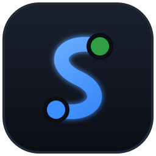
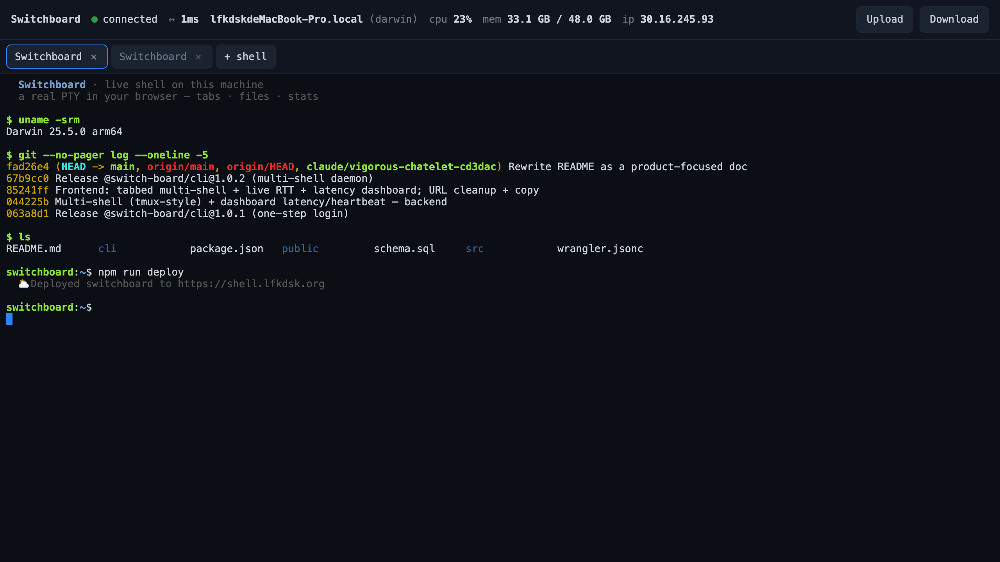
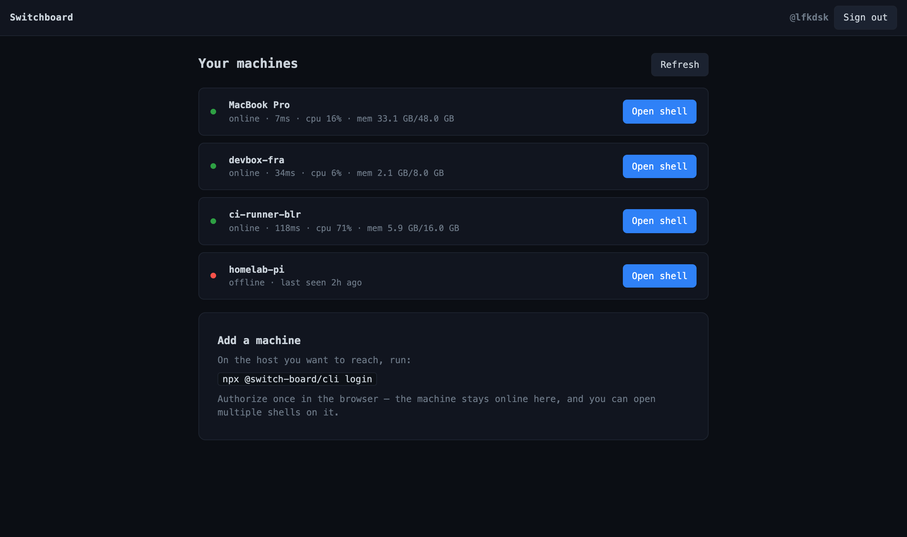
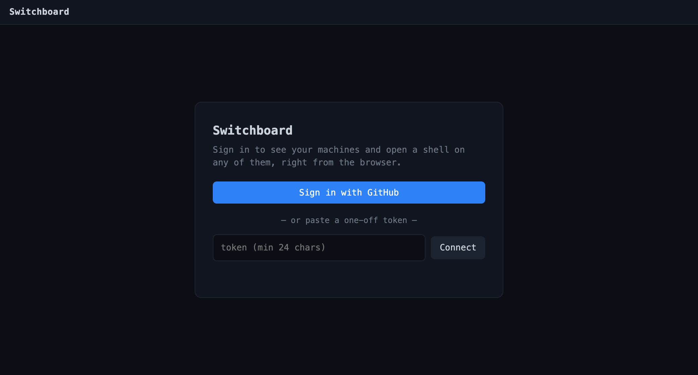

<p align="center">
  
</p>

<h1 align="center">Switchboard</h1>

<p align="center">
  <strong>A shell on any of your machines — right in your browser. No SSH config, no inbound ports, no VPN.</strong>
</p>

<p align="center">
  <a href="https://www.npmjs.com/package/@switch-board/cli"></a>
  &nbsp;<a href="https://www.npmjs.com/package/@switch-board/cli"></a>
  &nbsp;
</p>

<p align="center">
  
  <br><sub><em>A real shell in the browser — tabbed multi-shell, live RTT / CPU / memory, drag-and-drop file transfer.</em></sub>
</p>

Run one command on a machine and it shows up in your browser dashboard. Click it
and you get a real interactive terminal — tabs, file transfer, live host
stats — even when that machine sits behind NAT or a corporate firewall. Both the
machine **and** the browser dial *out* to a Cloudflare relay, so there's nothing
to port-forward and nothing to expose.

> Think of an old telephone switchboard: every connection is a **circuit**, and
> the operator — a Cloudflare Worker plus a Durable Object — patches your
> machine's line straight through to your browser's.

---

## Try it in 30 seconds

No install, no deploy — this uses the hosted relay at **`shell.lfkdsk.org`**:

```bash
npx @switch-board/cli login
```

It opens your browser, signs you in with GitHub, and exposes this machine's shell
under your account in one step. The dashboard URL it prints lists your machine —
click **Open shell** and you're in.

Just want to hand someone temporary access instead?

```bash
npx @switch-board/cli           # prints a one-off token + URL
```

Anyone you give that URL to gets a shell on the machine — handy for pairing or
quick remote help. No sign-in required; the token *is* the key (see
[Security](#security)).

<p align="center">
  
  <br><sub><em>Every machine you've signed in shows up here with live status — online, latency, CPU, memory.</em></sub>
</p>

---

## What you get

- **🖥️ A real terminal in the browser** — full xterm.js: 256-color, resize,
  scrollback, copy/paste. Not a log viewer — your actual shell.
- **📊 All your machines, one dashboard** — sign in with GitHub and every machine
  you've bound is listed with live status: online/offline, round-trip latency,
  CPU, memory, and last-seen.
- **👀 See what each host is doing** — without opening a shell. Every machine
  shows the foreground process of each open shell, how long it's been quiet, and
  the busiest processes on the box. Opt in with `SWITCHBOARD_ACTIVITY=claude` and
  running **Claude Code** sessions show up too: what each one is working on,
  which tool it's running, and whether it's mid-task or waiting on you — the
  thing cpu% can't tell you, since an agent blocked on an API call looks idle.
- **🗂️ Multiple shells, tmux-style** — open as many tabs as you want on a single
  machine. Shells survive tab reloads and flaky links; in account mode they keep
  running even after you close the browser, so you can reattach right where you
  left off.
- **📁 Drag-and-drop file transfer** — drop a file onto the page to upload it
  into the active shell's working directory, or pull any file off the host with a
  click.
- **🤝 Share one machine with one person** — hand `@someone` a shell on a single
  host, revocable and with an expiry, without giving them your account or a
  password-equivalent token. You choose whether the share is a shell for them to
  sit at, or one their agents may also drive.
- **🔗 Machines that drive each other** — `switchboard exec pi -- ...` runs a
  command on another host and gives you back its stdout, stderr and exit code,
  separately and unmangled. `switchboard flow` runs a whole graph of those across
  several machines, and `switchboard mcp` hands the same thing to Claude Code or
  Codex as tools, so an agent on your laptop can work on the box wired to your
  hardware.
- **🔌 Works behind NAT** — the daemon dials out over WebSocket. No inbound
  ports, no firewall rules, no VPN, no tunnel to babysit.
- **💤 Free at idle** — built on Cloudflare's hibernatable WebSockets, so idle
  terminals cost nothing and the whole thing runs on the free Workers plan.
- **🛠️ Self-hostable** — the relay is a few hundred lines of Worker code. Deploy
  your own and own the entire stack end to end.

---

## Two ways to connect

|                          | **Account** — `switchboard login`     | **Token** — `switchboard`              |
| ------------------------ | ------------------------------------- | -------------------------------------- |
| Sign-in                  | GitHub, once per machine              | none                                   |
| Who can open the shell   | only you                              | anyone holding the token               |
| Appears in the dashboard | ✅ with live stats                     | —                                      |
| Shell lifetime           | persists — reattach anytime           | persists across reloads (60s grace)    |
| Best for                 | your own machines                     | sharing · pairing · one-offs           |

Both modes give you the multi-tab terminal and file transfer; they differ only in
*who* can connect and how long shells stick around.

### Keep it running — macOS menu-bar app

Rather than leaving the CLI in a terminal window, you can run Switchboard as a
**menu-bar app** that lives in the top-right (no Dock icon), shows live status,
and can launch at login. It supervises the same daemon under the hood. Grab a prebuilt `.dmg` from the
[Releases](https://github.com/lfkdsk/Switchboard/releases) page (arm64 or Intel),
or build it yourself from [`macos/`](macos/README.md):

```bash
cd macos && scripts/make-app.sh && open build/Switchboard.app
```

### Share a sandbox, not your machine — the Agent Box

Sometimes you want to hand someone a shell but not *your* shell. [`docker/`](docker/README.md)
builds a container with **Claude Code** and **Codex** already in it and exposes
*that* through the relay:

```bash
cd docker && ./run.sh          # builds, starts, prints a share URL
```

Same token model, but the other end of the URL is a throwaway container with its
own filesystem — nothing of yours is mounted in, and `./run.sh reset` deletes the
whole thing. Everyone signs the agents in with their own account; the logins
persist in a volume.

### Keep it running — Linux background service

On Linux the daemon runs as a **systemd user service**, so it starts at boot and
keeps running after you log out — no terminal window, no tray icon needed:

```bash
npm install -g @switch-board/cli
switchboard login                  # bind this machine; Ctrl-C once it connects
switchboard service install
```

That writes `~/.config/systemd/user/switchboard.service`, enables it, and turns on
[lingering](https://www.freedesktop.org/software/systemd/man/loginctl.html#enable-linger%20USER%E2%80%A6)
so it survives logout. From there it's an ordinary unit:

```bash
systemctl --user status switchboard.service
journalctl --user -u switchboard.service -f
switchboard service uninstall
```

It installs at **user** scope, not `/etc/systemd/system` — the daemon reads your
`~/.switchboard/config.json` and spawns *your* login shell, so it runs as you and
needs no root. Sign in first: without a stored credential the service would mint
a fresh random token on every restart and nobody would ever see the URL. To pin a
token you already hold, use `switchboard service install --token <token>`.

> **Build prerequisite:** node-pty ships prebuilt binaries for macOS and Windows
> but **not Linux**, so installing compiles it from source. If `npm install`
> fails, you're missing a toolchain:
> `apt install -y python3 make g++` (or `dnf groupinstall "Development Tools"`).

> **No systemd?** On Alpine/Devuan (OpenRC) or WSL without systemd, `service
> install` will tell you so — run `switchboard` under your own supervisor
> instead. It handles `SIGTERM` cleanly and exits 0 when the relay hands its
> circuit to a newer daemon, so `Restart=on-failure` semantics work anywhere.

<p align="center">
  
</p>

---

## How it works

```
       your machine(s)                  Cloudflare  (the operator)             your browser
  ┌────────────────────────┐            ┌──────────────────────────┐
  │  @switch-board/cli      │   wss      │  Worker + Durable Object │   wss    ┌────────────────┐
  │  daemon  =  your shell  │ ─────────▶ │  "Circuit"  (one/token   │ ◀─────── │  xterm.js UI   │
  │                         │  dials out │   or one/machine)        │ dials in │  + dashboard   │
  └────────────────────────┘            │  + D1 account registry   │          └────────────────┘
        no inbound ports                └──────────────────────────┘       tabs · files · stats
```

- Both ends **dial out** over WebSocket — keystrokes flow one way, terminal
  output the other.
- `idFromName(token-or-machine)` funnels every daemon and browser on the same
  circuit into a single Durable Object — the operator that patches them together
  and broadcasts host output to every open tab.
- The relay is a **transparent forwarder**: it pairs the two ends and shovels
  frames between them. It never parses your terminal payload.
- A small **D1** database holds the account bookkeeping — which machines belong to
  whom, hashed agent tokens, and the heartbeat that powers the live dashboard.
  Terminal traffic never touches it.

The repo ships **both ends** — relay and daemon — so protocol-level features
(end-to-end encryption, port forwarding, …) can be built across the wire at once.
The daemon is wire-compatible with [`@elsetech/webterm`](https://www.npmjs.com/package/@elsetech/webterm),
which it's a clean reimplementation of.

---

## Share a machine with someone

A share is a **grant**, not a password. On your dashboard, open a machine's
**Share** panel and type a GitHub login: they get that one machine, in their own
dashboard, under their own account. You pick how long it lasts, and you can
revoke it in a click. Nothing bearer changes hands, so there is nothing for them
to forward, and revoking one person doesn't disturb anyone else.

Two kinds of share, and the difference matters:

| | **Shell only** (default) | **Shell + commands** |
| --- | --- | --- |
| They can open a terminal | ✅ | ✅ |
| Their agents and flows can drive it | — | ✅ |
| `switchboard exec` / MCP against it | refused | allowed |

"Shell only" is the default because letting someone sit at a terminal is a
smaller thing than letting their software run commands on your host unattended.
It's a guardrail on automation rather than a sandbox — someone with a shell can
still type whatever they like into it.

What a grant never confers: renaming, deleting, or re-sharing. Those stay with
the owner, so access can't be chained onward by whoever received it. Access is
re-checked against the database on **every connect**, so an expiry or a
revocation takes effect immediately — but a shell already open stays open until
it disconnects.

---

## Machines that drive each other

The same identity and the same grants that decide what you can open in a browser
decide what your machines may do to each other. A host that has run
`switchboard login` can drive any machine its account can reach, authenticating
with its own agent token — no share tokens to copy onto disk, and revoking in the
dashboard stops the automation too.

```bash
switchboard list                          # what can this host reach, and what may it do there?
switchboard exec pi -- uname -a           # one command, clean output, real exit code
echo "$FIRMWARE" | switchboard exec pi -- 'cat > /tmp/fw.bin'
```

`exec` allocates **no TTY**: stdout and stderr come back separately, free of
escape codes and prompt echo, and the process exits with the far command's own
status. That is what makes it safe to put in a pipeline or hand to an agent — the
browser terminal remains the thing for people.

### Flows — a graph of commands across machines

```jsonc
{
  "name": "nightly",
  "conductor": "buildbox",            // where this is meant to run (checked, not enforced)
  "steps": [
    { "id": "build",  "target": "buildbox", "cmd": "make -C ~/fw" },
    { "id": "flash",  "target": "pi",       "cmd": "flashrom -w /tmp/fw.bin",
      "on_failure": "recover" },
    { "id": "verify", "target": "pi",       "cmd": "sha256sum /dev/mtd0" },
    { "id": "recover","target": "pi",       "cmd": "flashrom -w /tmp/known-good.bin" }
  ]
}
```

```bash
switchboard flow check nightly.json    # validate and print the plan, contacting nothing
switchboard flow run   nightly.json    # execute it
```

Steps run in document order; `on_success` / `on_failure` are only for the
exceptions, and `stdin_from` pipes an earlier step's stdout into a later one's
stdin. Every target is resolved **before the first command runs**, so a typo in
the last step can't be discovered after the first four have already changed
something.

Whichever machine you run `flow run` on conducts it — there is no designated
conductor, because a flow whose steps all land on one host should be conducted by
that host and save a relay round trip per step. `conductor` records where the
author meant it to run, and you're told when it's running somewhere else.

Orchestration lives in the CLI, never in the relay. Teaching the relay to
sequence steps would mean teaching it to parse payloads, and that forecloses
layering end-to-end encryption underneath it.

### MCP — hand the machines to an agent

```bash
claude mcp add switchboard -- switchboard mcp
```

That exposes four tools: `list_machines`, `run_on`, `upload`, `download`. Now
"go build the firmware on buildbox and flash the pi" is something the agent can
actually carry out. Codex and anything else that speaks MCP over stdio works the
same way.

> **Think about this before you wire agents together.** An agent on machine A
> driving machine B means a prompt injection on A is code execution on B. Shares
> default to shell-only for exactly this reason; widen them deliberately, keep
> the blast radius somewhere you can throw away (the [Agent Box](docker/README.md)
> is one), and remember that `exec` runs whatever it's given.

---

## Self-host your own relay

Want to own the stack? Deploy the relay to your own Cloudflare account:

```bash
git clone https://github.com/lfkdsk/Switchboard.git && cd Switchboard
npm install
npx wrangler login                                   # one-time, opens a browser

# create the D1 registry and load the schema
npx wrangler d1 create switchboard_db                # paste the printed id into wrangler.jsonc
npx wrangler d1 execute switchboard_db --remote --file schema.sql

npx wrangler secret put SESSION_SECRET               # any long random string
npm run deploy
```

`schema.sql` only ever uses `CREATE TABLE IF NOT EXISTS`, so a database created
before a column existed never picks it up on its own. If yours predates one, run
the files in [`migrations/`](migrations/) once each, `--local` and `--remote`:

```bash
npx wrangler d1 execute switchboard_db --remote --file migrations/0003_add_can_exec.sql
```

Wrangler prints your URL (e.g. `https://switchboard.<subdomain>.workers.dev`).
Point the daemon at it:

```bash
npx @switch-board/cli --server https://switchboard.<subdomain>.workers.dev
```

To serve it on your own domain, add a route in `wrangler.jsonc`:

```jsonc
"routes": [{ "pattern": "switchboard.example.com", "custom_domain": true }]
```

> **Heads up on GitHub login:** the dashboard's GitHub sign-in is wired to the
> author's shared auth broker (`auth.lfkdsk.org`) and OAuth app. A fresh deploy
> works great in **token mode** out of the box; to get the account dashboard on
> your own domain, point `src/auth.js` at your own GitHub OAuth app and callback.

### Local development

```bash
npm run dev                 # wrangler dev → http://localhost:8787
npx @switch-board/cli --server http://localhost:8787
```

The daemon rewrites `http→ws` automatically. Durable Objects, hibernatable
WebSockets, and a local D1 all run under `wrangler dev` (apply the schema once
with `--local` instead of `--remote`).

---

## CLI reference

```
switchboard login            Sign in via the browser, then expose this machine's
                             shell under your account — one step.
switchboard                  Expose this shell using saved credentials, or an
                             anonymous one-off token if you're not signed in.
switchboard logout           Remove the stored account credential.
switchboard service install  Linux: run in the background via systemd, starting
                             at boot. Also: uninstall, status.
switchboard list             Machines this account can reach — your own, plus the
                             ones shared with you and what they allow.
switchboard exec <machine> -- <command…>
                             Run one command on another machine. No TTY: stdout
                             and stderr stay apart and the exit code is the
                             command's own. <machine> is a name or id from
                             `switchboard list`, or a share token.
switchboard flow <run|check> <file.json>
                             Run a graph of commands across several machines.
                             Whichever host you run it on conducts it.
switchboard mcp              Serve those machines to an agent over MCP (stdio).
```

| Option | Description |
| --- | --- |
| `-t, --token <token>` | Force anonymous mode with this token (min 24 chars). |
| `-s, --server <url>`  | Relay origin. Default: `https://shell.lfkdsk.org`. |
| `--shell <path>`      | Shell to spawn. Default: `$SHELL`, else `bash`/`powershell`. |
| `--timeout <ms>`      | `exec` only: give up on the command after this long. |
| `-v, --version`       | Print version and exit. |
| `-h, --help`          | Show help and exit. |

Environment variables (overridden by the flags above): `SWITCHBOARD_TOKEN`,
`SWITCHBOARD_SERVER`, `SWITCHBOARD_SHELL`. The `WEBTERM_*` equivalents are also
accepted for drop-in compatibility. Account credentials live in
`~/.switchboard/config.json` (mode `0600`).

`SWITCHBOARD_ACTIVITY=claude` additionally reports running Claude Code sessions
to your dashboard. It's off by default because a session's title summarises what
you asked for — more revealing than a process name. Even when enabled the daemon
sends only the title, the current tool name, and timestamps; never your prompts
and never message contents. Shell process names and cwds are always reported,
and never include command-line arguments (those routinely carry secrets).

---

## Security

- **The token is the only credential in token mode.** Anyone with it gets a shell
  on the host — treat it like a password. It's a fresh 256-bit random value per
  run, so guessing is infeasible.
- **Account mode is gated by GitHub identity.** A machine bound with
  `switchboard login` can only be opened by its owner or someone the owner has
  shared it with; sessions are HMAC-signed cookies, and agent tokens are stored
  **hashed** (SHA-256) in D1.
- **Shares are grants, checked on every connect.** They're keyed on the grantee's
  numeric GitHub id, so a share survives a rename and never lands on a stranger
  who later claims a freed login. Revoking writes a tombstone rather than
  deleting the row — who was let in, and when they were cut off, is worth
  keeping. Deleting a machine takes its grants with it, because machine ids are
  chosen by the CLI and re-registering the same host would otherwise resurrect
  access the owner thought they'd thrown away.
- **Automation is a separate permission.** A host's agent token authenticates it
  to the relay as its own account, and a share must say `shell + commands` before
  anyone else's software can drive your machine. Chaining agents across hosts
  turns a prompt injection on one into code execution on another — decide that
  deliberately rather than by default.
- **The relay sees plaintext.** TLS terminates at the Worker, so the operator
  (you, when self-hosting) can see the stream. Switchboard is **not** end-to-end
  encrypted — self-hosting removes the third party, not the relay's visibility.
  Because the relay forwards opaque bytes, you can layer E2E (e.g. X25519 + an
  AEAD between daemon and browser) without changing it.
- **Gate the relay itself** with Cloudflare Access if you want auth in front of
  the whole Worker.
- The frontend loads `xterm.js` from jsDelivr; vendor the `@xterm` files into
  `public/` to drop that external dependency.

---

## Project layout

| Path | What it is |
| --- | --- |
| `src/index.js` | Worker entry + router (WebSocket, auth, CLI-login, dashboard API) |
| `src/circuit.js` | The `Circuit` Durable Object — the per-token/per-machine relay |
| `src/auth.js` | GitHub OAuth sessions (HMAC-signed cookies) |
| `src/registry.js` | D1 bookkeeping: machines, agent tokens, CLI-login handshake |
| `public/index.html` | The browser app — terminal, tabs, dashboard, file transfer |
| `public/cli-login.html` | The `switchboard login` authorization page |
| `schema.sql` | D1 schema |
| `migrations/` | Incremental D1 changes, for databases that predate a column |
| `wrangler.jsonc` | Cloudflare config (DO binding, D1, routes, static assets) |
| `cli/` | `@switch-board/cli` — the host daemon |
| `cli/activity.js` | Host activity: shell processes, top-by-cpu, Claude Code sessions |
| `cli/target.js` | Resolving "which machine?" into how to dial it |
| `cli/flow.js` | The flow runner — one command remotely, and the graph around it |
| `cli/mcp.js` | The MCP stdio server: `list_machines`, `run_on`, `upload`, `download` |
| `macos/` | Native menu-bar app that supervises the daemon (see [macos/README.md](macos/README.md)) |
| `docker/` | Agent Box — a shareable container with Claude Code and Codex in it (see [docker/README.md](docker/README.md)) |

---

MIT licensed.
